# jobcanary

[](https://github.com/AlexLiaoooo/jobcanary/actions/workflows/ci.yml)
[](https://nodejs.org)
[](LICENSE)

A config-driven job monitor: it polls career sites and ATS job boards, filters and scores the postings against rules you define, and writes a ranked Markdown (or JSON) digest.

## What it does

- Fetches job listings from a small set of ATS adapters (Greenhouse, Lever, Workday) using their public, unauthenticated JSON APIs.
- Filters postings against `exclude` and `annotate` rules you write (regex or plain-text matching on title, company, location, or description).
- Scores the survivors and ranks them.
- Deduplicates against a `seen.json` file so the same posting is not reported twice.
- Writes a ranked digest to disk as Markdown, JSON, or both.

## What it does not do

- **It does not apply to jobs.** jobcanary only reads and reports; it never submits an application, fills a form, or sends anything on your behalf.
- **It has no LinkedIn adapter**, and none is planned — LinkedIn's terms prohibit this kind of automated access. See [Sources and terms](#sources-and-terms).
- **It does not call an LLM by default.** Scoring is a deterministic keyword match unless you opt into `scoring.provider: anthropic` or `claude-cli`. See [Scoring providers](#scoring-providers).

## Install

Requires Node.js 20 or later.

```bash
git clone https://github.com/AlexLiaoooo/jobcanary.git
cd jobcanary
npm install
```

This installs the single runtime dependency (`yaml`) and nothing else — job fetching uses the platform `fetch`, and argument parsing uses `node:util`'s `parseArgs`, so there is no CLI framework to pull in.

The `anthropic` scoring provider needs one more package, `@anthropic-ai/sdk`, but it is declared as an optional peer dependency rather than a regular one — `npm install` above will not pull it in. Install it yourself only if you use that provider: `npm install @anthropic-ai/sdk`. The `claude-cli` provider needs no extra package; it shells out to a `claude` you already have.

Run the CLI directly with Node:

```bash
node bin/jobcanary.mjs run --config examples/config.yaml
```

Or link it so the `jobcanary` command is on your `PATH`:

```bash
npm link
jobcanary run --config examples/config.yaml
```

## Quickstart

[`examples/config.yaml`](examples/config.yaml) is a complete, runnable configuration against three fictional companies. Copy it as a starting point:

```bash
cp examples/config.yaml jobcanary.yaml
# edit jobcanary.yaml: replace the example sites with real boards, adjust keywords and rules
jobcanary run --config jobcanary.yaml
```

A first run creates the output directory (`./digests` by default) and writes a dated digest, e.g. `digests/2026-08-19.md`, plus a `digests/seen.json` dedup file. Re-running the same command later only reports postings that are new since the last run.

Add `--dry` to fetch and see the counts without writing anything:

```bash
jobcanary run --config jobcanary.yaml --dry
```

## Demo



One run against two Workday boards: the first returns two postings, the second
is down. Failures are named rather than passed over, and the rule that matched
`gt-suite` *annotates* the posting instead of dropping it — that is the whole
idea of `annotate` rules.

## What a digest looks like

Sorted by score, then newest first, then by company for postings whose board
stated no date. Rules that *annotate* rather than exclude show up as a
**Notes** line, so a posting is flagged for your judgement instead of being
silently dropped. A site that failed is named in a footer rather than passed
over in silence.

```markdown
# Job Picks — 2026-08-19
**Scanned:** 214 · **New:** 3

### [9/10] Graduate Powertrain Engineer · Nordholt Racing
- **Location:** Bicester, UK · **Posted:** 2026-08-18
- **Fit:** Matched configured keywords: graduate, powertrain, hybrid.
- **Link:** https://jobs.lever.co/nordholt/b1e7c2a4

### [5/10] Thermal Systems Engineer · Vantor Propulsion
- **Location:** Bicester, UK · **Posted:** 2026-08-17
- **Fit:** Matched configured keywords: thermal, gt-suite.
- **Notes:** Mentions a sponsorship restriction — verify eligibility
- **Link:** https://vantor.wd3.myworkdayjobs.com/.../Thermal-Systems-Engineer_R-1001

### [3/10] Design Engineer · Acme Dynamics
- **Location:** Oxford, UK · **Posted:** 2026-08-16
- **Fit:** Matched configured keywords: cad.
- **Link:** https://boards.greenhouse.io/acmedynamics/jobs/4001

## Site errors

- zenith-motors — HTTP 503
```

With `format: json` you get the same data as structured records instead,
including the per-run `stats`, so you can pipe it somewhere else.

## Config reference

A config file is YAML. Every key below is optional except `sites`.

```yaml
profile: ./profile.md        # a free-text file describing you; required if scoring.provider is 'anthropic' or 'claude-cli', unused by 'none' (default: none)

output:
  dir: ./digests              # where digests and seen.json are written (default: ./digests)
  format: markdown            # markdown | json | both (default: markdown)

dedupe:
  retentionDays: 30           # positive integer; how long a posting id is remembered in seen.json (default: 30)

scoring:
  provider: none               # none | anthropic | claude-cli (default: none)
  keywords: [graduate, cfd]     # used only by the 'none' provider (default: [])
  model: claude-opus-5           # used by the 'anthropic' provider (default: claude-opus-5)
  effort: high                    # low | medium | high | xhigh | max — 'anthropic' provider (default: high)
  concurrency: 5                   # 'anthropic' provider: requests kept in flight at once (default: 5)
  rubric: ./rubric.md               # optional; overrides the built-in rubric for either LLM provider (default: built-in)
  batch: false                       # must stay false — the Batch API is not implemented (default: false)

rules:                        # optional; both lists default to empty (no filtering, nothing excluded)
  exclude:                     # postings matching any exclude rule are dropped entirely
    - id: senior                # required (any truthy value); identifies the rule in the internal verdict, not surfaced in the digest or logs — not required to be unique
      field: title               # title | company | location | description | all (default: all)
      match: ["senior", "/^head of/i"]   # plain strings match case-insensitively as literals;
                                          # a /regex/flags string compiles as a real regex
  annotate:                    # postings matching an annotate rule are kept, with a note attached
    - id: right-to-work
      field: description
      match: ["no visa sponsorship"]
      note: "Mentions a sponsorship restriction — verify eligibility"   # required for annotate rules

sites:                         # required, at least one entry
  - id: acme                    # required, unique within the config
    company: Acme Dynamics       # required — shown in the digest
    type: greenhouse              # required — see the adapter table below
    enabled: true                  # optional (default: true) — set false to keep a site configured but skip it
    board: acmedynamics             # adapter-specific fields go here; see below
```

`scoring.model` and `scoring.effort` are read by the `anthropic` provider only; the `none` provider ignores both, and `claude-cli` defers to whatever your `claude` install is already configured to use. `scoring.concurrency` likewise bounds `anthropic`'s parallel requests — `claude-cli` batches ten postings per invocation instead and does not use this key. `scoring.rubric` and `profile` (below) apply to both LLM providers equally. `scoring.batch` is parsed and defaulted to `false`, and stays that way: see [Scoring providers](#scoring-providers) for why.

Each `match` entry is either a plain string (matched case-insensitively as a literal substring/word) or a `/pattern/flags` string, which compiles to a real `RegExp` with the flags given — so `/PhD/` is case-sensitive while `/PhD/i` is not.

The `g` and `y` flags are accepted but ignored: they make a `RegExp` stateful (`.test()` advances `lastIndex`), and a rule is compiled once and reused for every posting, so honouring them would make a rule match every *other* posting. `/senior/gi` therefore behaves exactly like `/senior/i`.

### Postings excluded on their description are re-fetched every run

`seen.json` records only the postings that reached a digest. A posting dropped by an `exclude` rule is never recorded — so for a `workday` site, whose descriptions cost a second request per posting, that detail page is fetched again on the next run, and on every run after that.

This is deliberate. Recording exclusions would stop the repeat fetch, at the price of a worse failure: your rules are live and editable, and a posting excluded under yesterday's rules has to be able to surface once you loosen them. State that outlives the rule which produced it silently contradicts your config.

The cost is reported rather than hidden. The run summary's `enrichmentFetches=` count is the number of detail requests the run actually performed; `stats.enrichmentFetches` carries the same number to library callers and into the JSON digest, alongside `stats.excludedIds`. If that count is high and `kept` is low, prefer rules that match on `title` (no detail request needed) over rules that match on `description`.

A later release will make this converge properly — a separate excluded-id map, invalidated by a hash of the rules, so an exclusion is remembered only for as long as the rules that produced it are unchanged.

### A posting that could not be scored is not marked seen

`seen.json` records the postings a run actually scored. One that came back unscored — a single rate-limited request, a batch that would not parse — is left out deliberately, so the next run fetches it again and gives it a real score. Recording it would retire it on the strength of a failure: it would have appeared once, unranked at the bottom of a digest, and never been offered again.

The run summary's `unscored=` count says how many postings that was. It matters because a partial scoring failure is otherwise silent: the run exits 0 and prints `scoring=ok`, because three failures out of ten are tolerated by design rather than escalated. `stats.unscored` carries the same number to library callers and into the JSON digest.

### Running more than once in a day

A digest is named for the day, but a day can hold more than one run. jobcanary
never overwrites one: a later run that finds nothing new leaves the existing
digest alone, and a later run that does find something writes alongside it as
`2026-08-20-2.md`. Nothing a run produced is ever replaced by a later one.

## Adapters

Every adapter reads a site's public, unauthenticated job API — no login, no API key. The `type` you choose determines which extra fields the site entry needs:

| `type`       | Required fields              | Notes |
|--------------|-------------------------------|-------|
| `greenhouse` | `board`                       | Greenhouse board token, e.g. the `xyz` in `boards.greenhouse.io/xyz`. Descriptions ship with the listing. |
| `lever`      | `board`                       | Lever account slug, e.g. the `xyz` in `jobs.lever.co/xyz`. Descriptions ship with the listing. |
| `workday`    | `host`, `tenant`, `board`     | `host` is the tenant's Workday origin (e.g. `https://acme.wd3.myworkdayjobs.com`), `tenant` the CXS tenant name, `board` the career site name (often `External`). Descriptions require a second request per posting, done automatically for postings that survive the rules. |

Only these three adapters exist today. A larger adapter fleet (static career pages, and ATS platforms including Ashby, SmartRecruiters, Personio, Recruitee, Occupop, and others) is planned for a later release, along with a browser-driven tier for sites with no JSON API.

## Scoring providers

- **`none`** (the default) — a deterministic, offline keyword scorer. It counts matches against `scoring.keywords` and never omits a posting; it exists so the tool is fully useful and testable without any API key or network call beyond fetching the listings themselves.
- **`anthropic`** — scores each posting in one cached request against the Anthropic API directly. Needs `ANTHROPIC_API_KEY` in the environment and the optional peer dependency installed (`npm install @anthropic-ai/sdk` — see [Install](#install)).
- **`claude-cli`** — free if you already have Claude Code installed and are logged in: it batches ten postings per `claude -p` invocation and matches each result back to its posting by the id the model echoes, rather than by position. Needs `claude` on `PATH` — set `JOBCANARY_CLAUDE_BIN` if it lives somewhere `PATH` doesn't reach. A batch that fails to run or to parse degrades just its own postings to unscored, so one flaky invocation does not cost the whole run's results. But if *nothing* comes back scored, that is systemic rather than a one-off hiccup, and is treated as a run-level scoring failure: see [Exit codes](#exit-codes).

### Prompt caching, and how to tell whether it is working

The `anthropic` provider sends one request per posting. That is a correctness decision — batching N postings into one request adds a pairing step whose failure mode is attaching the wrong rationale to the wrong job — and it is affordable only because the rubric and your profile form a byte-identical prefix on every request, marked for prompt caching.

**Caching only engages if that prefix clears the model's minimum cacheable length.** Below it, the cache marker is ignored silently: no error, no warning, nothing in the response to notice — only a larger bill. The minimum is per model and is not monotonic across generations: 512 tokens on Claude Opus 5, 1024 on Claude Sonnet 5 and Opus 4.8, 2048 on Opus 4.7, and higher still on some older models. The built-in rubric plus [`examples/profile.md`](examples/profile.md) is roughly 3,000 characters — very approximately 750 tokens — which clears Claude Opus 5's minimum but not by a wide margin, and a two-line profile would fall under it. If you write a short profile, or point `scoring.model` at a model with a higher minimum, expect caching not to engage.

So the run reports it. When a run issues any scoring requests, the summary prints a second line:

```
scoringRequests=40 cacheReadTokens=18240 cacheCreationTokens=760
```

`cacheReadTokens=0` across a run of more than one posting means caching never engaged, and jobcanary says so in a note under the line. The `claude-cli` provider prints `cache=unreported` instead: what a `claude` process does with the prompt is not visible from here, and reporting a zero nobody measured would be worse than reporting nothing. `stats.scoringRequests`, `stats.cacheReadTokens` and `stats.cacheCreationTokens` carry the same numbers to library callers and into the JSON digest, with the two cache figures `null` when the provider cannot observe them.

### Everything a provider needs is checked before the first site is fetched

`jobcanary run` proves the scoring provider can work before it spends anything on a crawl. For `anthropic` that means `ANTHROPIC_API_KEY` in the environment and `@anthropic-ai/sdk` importable; for `claude-cli` it means the `claude` binary actually running (it is asked for its `--version`); for both it means the `profile` file — and the `scoring.rubric` file if you set one — being readable. Any of them missing stops the run with a config error and **exit 2**, before a single request goes to a job board.

The point is money and time: paying for a full crawl and a detail request per posting, only to discover an unset API key or an uninstalled binary, is the failure this ordering exists to prevent.

Both LLM providers need `profile` set in the config: a path to a Markdown (or plain text) file describing the candidate, read fresh on every run and sent once as part of the cached prompt prefix. Set `scoring.provider` to `anthropic` or `claude-cli` without a `profile` and the config fails validation before anything is fetched — see [`examples/profile.md`](examples/profile.md) for a starting point.

`scoring.rubric` optionally points at a Markdown file that replaces the built-in scoring rubric — the default asks the model for a 1-10 fit score and a one-sentence rationale grounded in the profile, and never invites it to leave a posting out.

The built-in rubric is written for a list that has **already** been narrowed twice, by the sites you chose to watch and by the exclude rules you wrote. Broad relevance is therefore the baseline rather than evidence of a good match: the rubric reserves 9-10 for a posting that names the specific tools and sectors your profile names, tells the model to expect most postings to land mid-scale, and asks it to separate two postings in the same band rather than sit on the band edges. Without that, a graduate profile against a list of surviving graduate postings scores 8 or 9 every time, and a digest with no spread is a digest with no ranking. If you write your own rubric, keep that property — it is the difference between a shortlist and a list.

`scoring.batch` defaults to `false` and must stay that way: the Batch API's 24-hour turnaround does not suit a tool meant to produce a same-day digest, so it is not implemented here. Setting `scoring.batch: true` is rejected at config load with a clear error, rather than accepted and silently ignored.

Either LLM provider scores and ranks, but never omits. A posting it could not score — because a single request failed, the reply didn't parse, or the provider errored outright — still appears in the digest, marked `[—]` in place of a score and sorted after every scored posting rather than disappearing. If scoring fails outright, the crawl's results are not thrown away: the digest is written with every posting unscored, and `jobcanary run` exits 4 so the failure is visible without having to read the digest to notice it.

## Exit codes

| Code | Meaning |
|------|---------|
| 0    | Success |
| 1    | Unexpected error |
| 2    | Config invalid (missing file, bad YAML, unknown adapter type, failed validation) |
| 3    | Every configured site failed to fetch, or every site returned zero postings (a systemic break: network down, or an adapter gone stale) |
| 4    | Scoring failed. The crawl still succeeded and the digest was still written, with the affected postings unscored — the `none` provider is pure and cannot trigger this. |

## Sources and terms

jobcanary reads **public career pages and unauthenticated ATS endpoints only**. It does not log in, does not use private or scraped credentials, and does not bypass any access control.

You are responsible for the terms of service of any site you configure jobcanary to poll. Automated access is not universally permitted — check before you add a site, and keep your request rate reasonable.

No adapter will be accepted into this project for a site whose terms of service prohibit automated access. This is why there is no LinkedIn adapter and none is planned.
